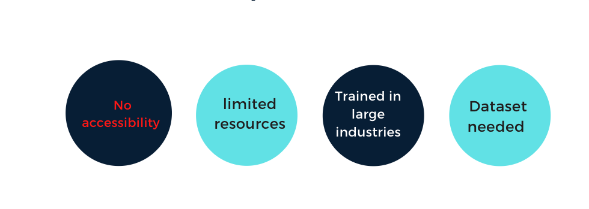
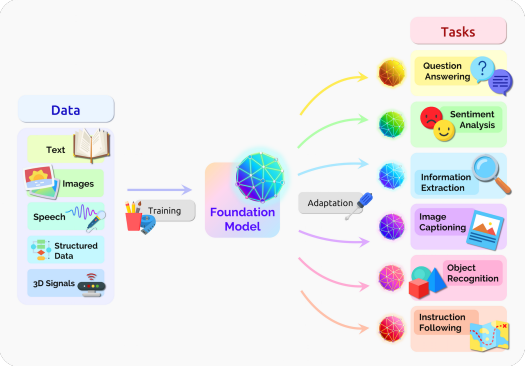
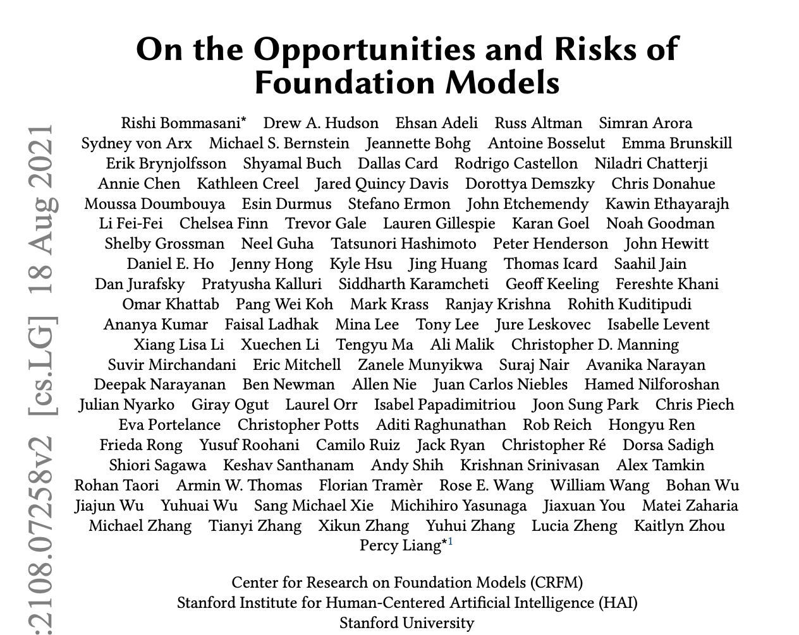
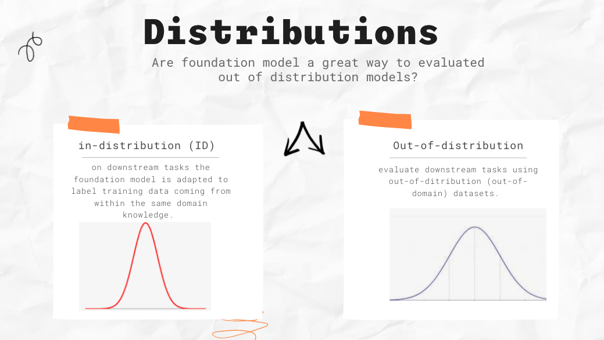
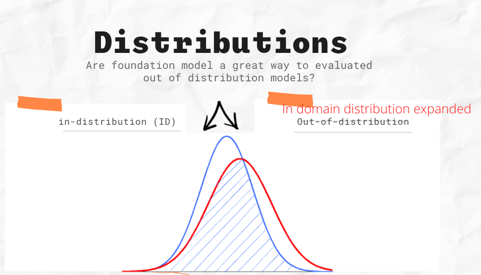

# Opportunities-and-Risks-of-Foundation-Models
This is a collaboration report written by over 100 researchers (faculty, student) from more than 10 departments and Stanford University on the opportunities and risks of Foundation models(large pre-trained models)

## An Overview

### Why conduct the research?

1. Artificial Intelligence(AI) is currently experiencing a paradigm change with the upsurge of large pre-trained models such as GPT-3, BERT, CLIP etc. Models are trained on **broad** data at **scale** and adapted(fine-tuned) to wide range of downstream tasks. Foundation models indicate a shift where increasingly massive quantities of data are being “fed” to these models to improved adaptation performance.

2. The report emphasize these foundation models to underscore their importance yet incomplete character. The reason for the term foundation models rather than prior existing terms (pre-trained models, self-supervised models)

3. The report divided into four parts that provides a detailed explanation of the opportunities and risks of foundation models.
- **capabilities** (robotics, language, human interaction, vision etc)
- **technical principle** (architecture, training procedure, security, evaluation, etc)
- **application** (education, law, healthcare)
- **Societal impact** (misuse, ethical implications, inequity, economic and environmental, etc)

4. Foundation Models are based on established deep learning models and the use transfer learning. Therefore, its scale produces in new *emergent* capabilities and thus their effectiveness across many task incentivizes *homogenization*.
- emergence:- behavior of the models is implicitly induced rather than explicitly encoded.
- homogenization:- consolidation of models used for a wide range of applications.Examples include: GPT-3 and CLIP. Homogenization delivers a mighty influence but caution needs to be taken. The faults(defects) of the foundation models are passed on to all the adapted models downstream.   

5. There is lack of clear understanding of how Foundation models actually work, what are their capabilities as a result of emergent properties and when they will fail.

6. Foundation models are probable of perpetuating harm, with misunderstood characteristics.

7. Foundation models are empowered by scale and transfer learning. Their impact is unquestionable.  

### Data Management Opportunities for Foundation Models

From their paper, Orr, Goel, and Re  describe key data management challenges and opportunities with the foundation models.

## Discussion Topic 1

From the report there were more than 100 researchers from more than 10 departments who wrote the 200 pages. Why do you think were the reason for this phenomenon?

## Discussion Topic 2

The report definition of foundation models highlights that **" foundation models are trained on broad data at scale"**. How is broad is broad data at scale? How can it be adapted to a wide range of downstream tasks?

  

## Discussion Topic 3

The Foundation models provide excellent in adapting to downstream tasks. What do you think are the harms related to foundation models? What are some ethical, social or political challenges that foundation models pose?

## Critical Analysis

The report highlighted the benefits and risks of the foundation models and created an avenue for institutions that do not have large compute power in comparison to large companies like google, facebook, etc to create foundation models that can be generalize to downstream tasks.They did not indicate how to mitigate harms cause by foundation models during emergence. This limitation should be highlighted. If we think about the whole ecosystem from data curation to training a model to adapting to downstream tasks to the deployment of the model, I believe there ought to better characterization of the properties in datasets and models.

## Resource links

* [Original Article](https://arxiv.org/abs/2108.07258)
* [Code and trained Foundation Models are released at ](https://github.com/stanford-crfm/transformers)
* [GPT-Neo 1.3B transformers](https://huggingface.co/EleutherAI/gpt-neo-1.3B)
* [Data Manegement](http://cidrdb.org/cidr2022/papers/p51-orr.pdf)

## Code demonstration

Google colab provides GPU/TPU for free, which should be enough to fine-tune our model up to use OpenAI CLIP Model.
Click  to run through the demonstration colab notebook.

## Video Recording

The Link to video is [here](https://youtu.be/Vsjw-oDTZf0)
